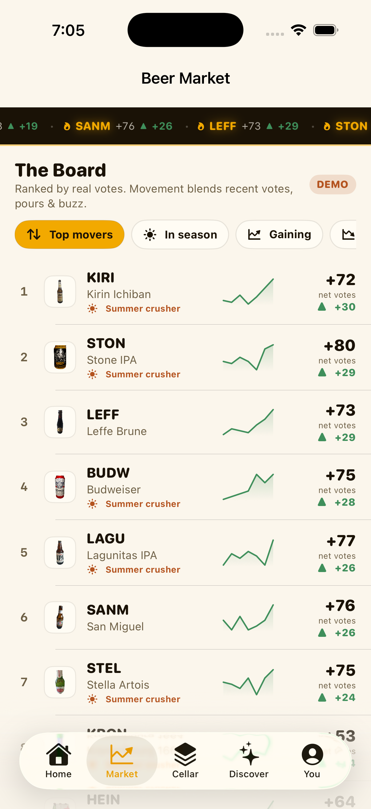
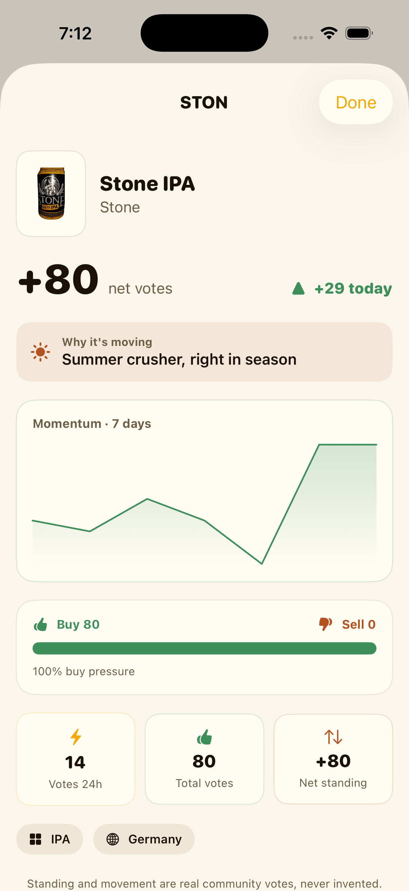
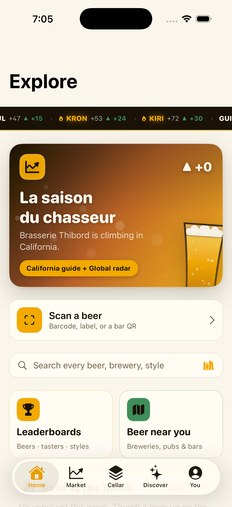
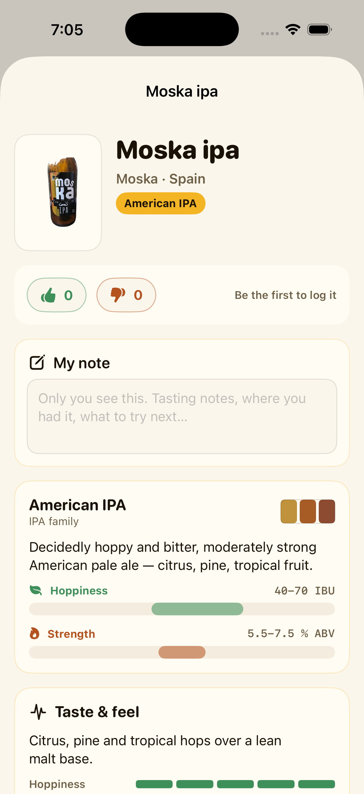
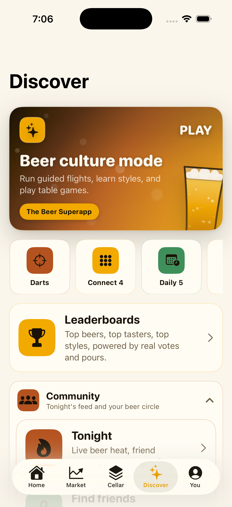
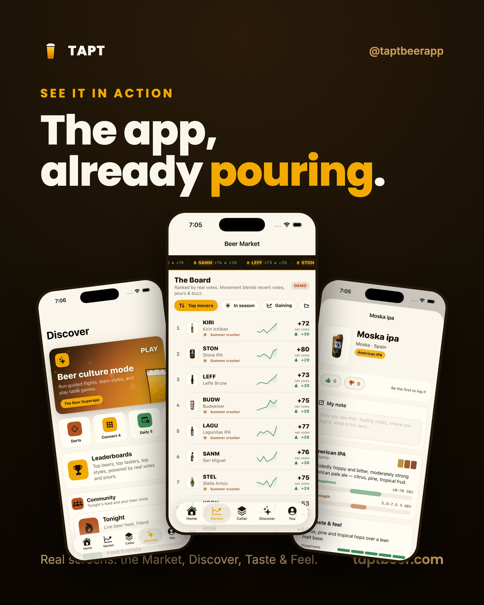
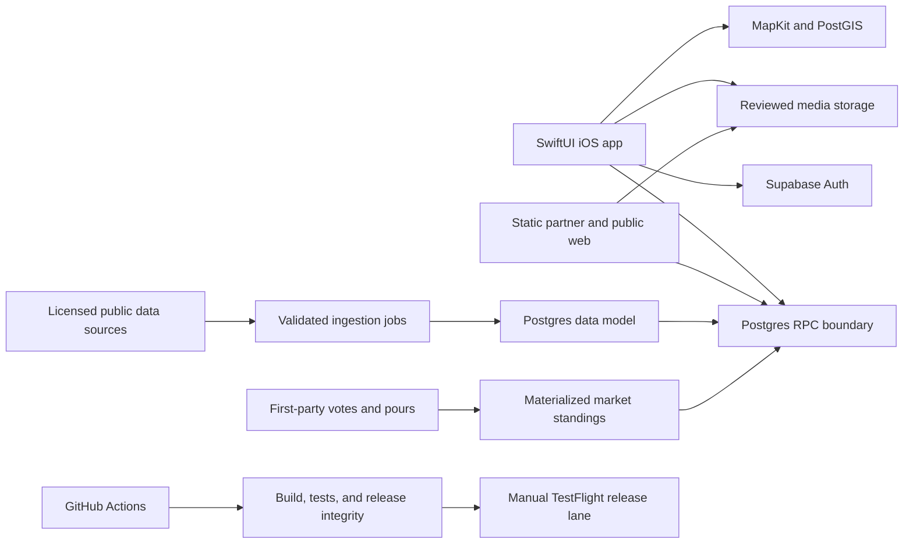

# Tapt

<p align="center">
  
</p>

<p align="center"><strong>THE Beer Superapp. All of beer, one app.</strong></p>

<p align="center">
  <a href="https://taptbeer.com">Website</a> |
  <a href="#product-tour">Product tour</a> |
  <a href="#architecture">Architecture</a> |
  <a href="#build-and-test">Build and test</a> |
  <a href="SECURITY.md">Security</a>
</p>

Tapt is a native iOS product for discovering real beers, scanning supported labels and barcodes, logging pours to a Cellar, collecting a location-aware Passport, following a live Beer Market, and finding beer venues worldwide.

**Stack:** Swift 6, SwiftUI, Supabase (Postgres, PostGIS, Auth, Storage, Edge Functions), MapKit, XcodeGen, Python, Deno, and GitHub Actions.

## Product tour

<table>
  <tr>
    <td></td>
    <td></td>
    <td></td>
  </tr>
  <tr>
    <td></td>
    <td></td>
    <td></td>
  </tr>
</table>

## What ships

- **Beer radar:** provenance-backed venues, MapKit search, and PostGIS nearby feeds
- **Catalog:** normalized beer identities, sourced product media, barcode resolution, style data, and nutrition where available
- **Beer Market:** standings derived from season, cited awards, catalog context, and first-party votes and pours
- **Cellar and Passport:** distinct-beer progress across styles, states, and countries
- **Social:** profiles, follows, a Tonight feed, reporting, blocking, and privacy-respecting public aggregates
- **Partner tools:** venue claims, hosted menus, printable QR pages, events, and analytics
- **Beer School and games:** verified beer education plus local table games

## Honest-data rule

Tapt never fabricates products, venues, rankings, ratings, votes, movement, or product imagery. Every venue carries coordinates and provenance. Beer Market numbers are computed from real inputs. Empty states remain empty until real activity exists.

## Architecture



The client does not receive service-role credentials. Sensitive operations are implemented behind authenticated Edge Functions or narrowly granted RPCs. Public analytics use coarse aggregates and honor visibility, block, and consent boundaries.

## Repository map

| Path | Purpose |
| --- | --- |
| `app/` | Native SwiftUI application, tests, privacy manifest, and XcodeGen spec |
| `supabase/` | Versioned schema migrations, Edge Functions, and database contracts |
| `landing/` | Public site, partner portal, menus, and owner operations surfaces |
| `scripts/` | Reproducible ingestion, verification, image, and App Store tooling |
| `docs/` | Product, architecture, privacy, data-source, and release decisions |
| `.github/workflows/` | CI, data maintenance, TestFlight, and App Store release gates |

## Build and test

Requirements: macOS, a current Xcode installation, and XcodeGen.

```sh
cd app
xcodegen generate
xcodebuild test \
  -project Tapt.xcodeproj \
  -scheme Tapt \
  -destination 'platform=iOS Simulator,name=iPhone 16 Pro'
```

Useful repository-level validation:

```sh
python -m unittest discover -s scripts -p 'test_*.py'
python -m compileall -q scripts
```

Copy `.env.example` only for the supported local tools that require it. Never commit credentials.

## Delivery

- `build.yml` compiles and tests app changes on pushes and pull requests.
- `release-integrity.yml` validates Python, workflows, Edge Functions, admin code, and the live anonymous RPC contract.
- `testflight.yml` performs a manual signed archive and TestFlight upload.
- App Store preparation, audit, screenshot, submission, and withdrawal workflows are separate explicit lanes.

## Status

Tapt 1.0 is in the App Store release process. The public site is live at [taptbeer.com](https://taptbeer.com). See the commit history and pull requests for current release evidence.

## Contributing and security

Read [CONTRIBUTING.md](CONTRIBUTING.md) before proposing a change. Report vulnerabilities privately using [SECURITY.md](SECURITY.md), not through a public issue.

## License

Copyright 2026 Erick Dronski. The source is publicly visible for evaluation and collaboration, but no license to copy, redistribute, or create derivative works is granted. See [LICENSE](LICENSE).
