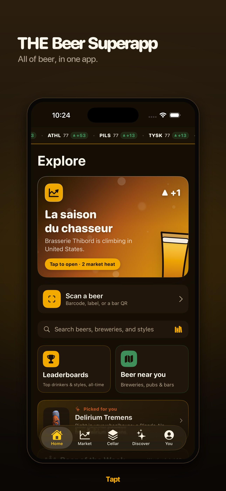
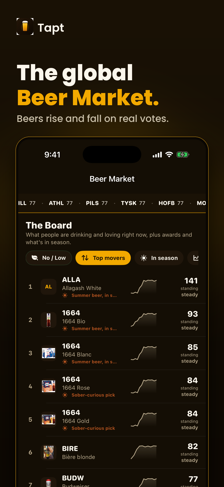
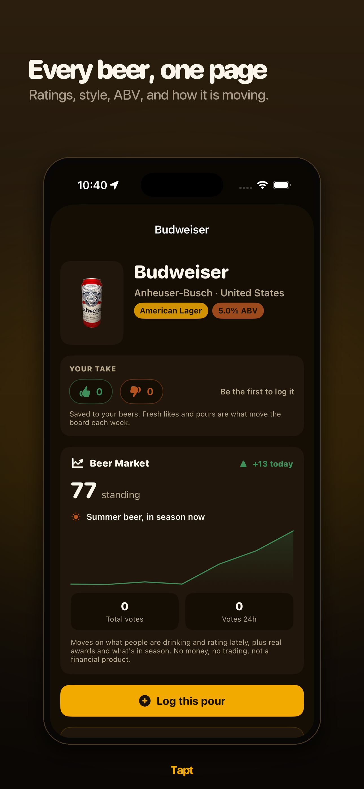
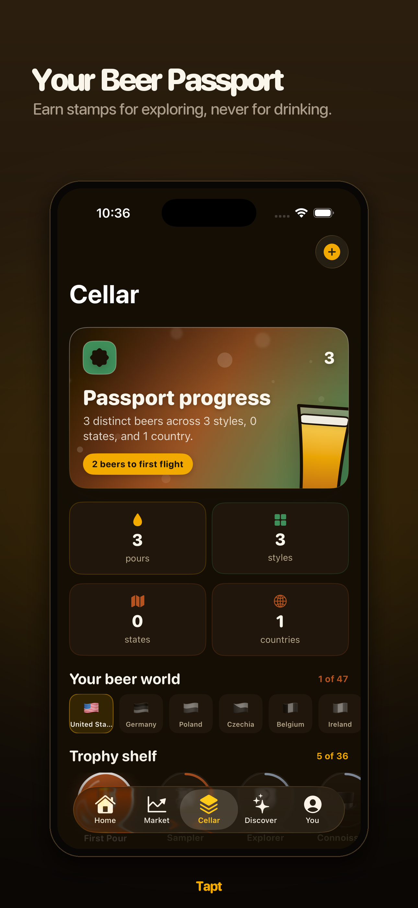
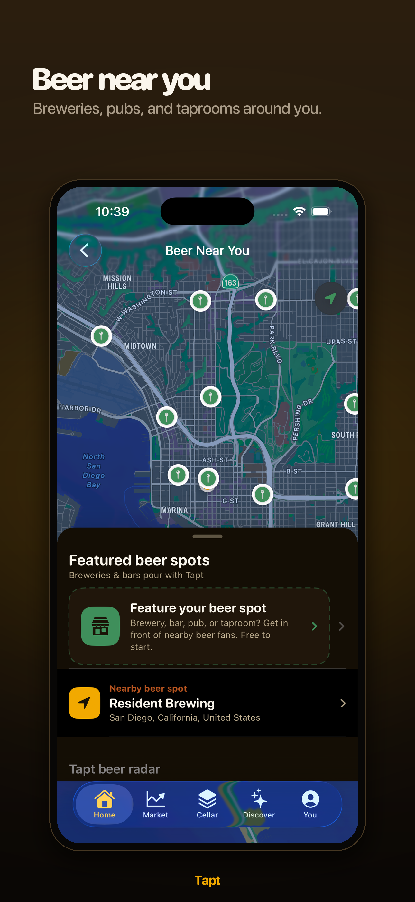
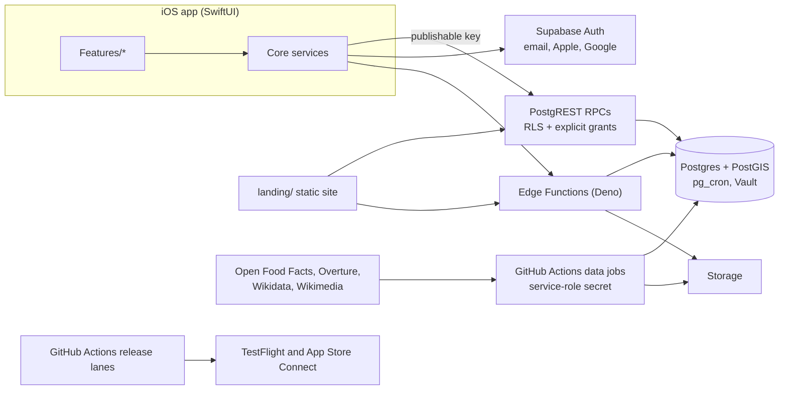

# Tapt

<p align="center">
  
</p>

<p align="center"><strong>THE Beer Superapp. All of beer, one app.</strong></p>

<p align="center">
  <a href="#status">Status</a> ·
  <a href="#architecture">Architecture</a> ·
  <a href="#build-and-test">Build and test</a> ·
  <a href="#ci-and-release-automation">CI and releases</a> ·
  <a href="#security-and-privacy">Security</a> ·
  <a href="#license">License</a>
</p>

Tapt is a native iOS app for finding, scanning, logging, and ranking real beers,
built in Swift 6 and SwiftUI on a Supabase backend, with the data pipelines and
App Store release automation that feed and ship it.

<p align="center">
  
  
  
  
  
</p>
<p align="center"><sub>App Store screenshot set from the 1.0 submission (July 2026).</sub></p>

## Status

As of October 2026:

| Area | State |
| --- | --- |
| App Store | Not available. Version 1.0 was last submitted to App Review on 2026-07-24 and is not listed on the App Store. |
| TestFlight | Builds were uploaded through 2026-07-24 by the `TestFlight` workflow. |
| Backend | The production Supabase project is paused. The app builds and its tests pass, but it cannot load live data until the project is restored. |
| Website | Live at [taptbeer.com](https://taptbeer.com), served from [`landing/`](landing/) by the Vercel project `tapt-landing`. Pages that read data (menus, partner portal, newsletter signup) need the backend restored. |

The app builds and its 69 unit tests pass on the iOS 26.5 and 27 simulators; scheduled data jobs are paused until the backend is back (see [CI and release automation](#ci-and-release-automation)).

## Features

- **Scan and search:** barcode, label, and bar-QR scanning with VisionKit, plus
  full-catalog search with server-side barcode verification.
- **Beer pages:** normalized beer identities with style, brewery, country,
  nutrition where available, and sourced product imagery.
- **Beer Market:** standings computed from season, cited awards, catalog context,
  and first-party votes and pours, with history from daily snapshots.
- **Cellar and Passport:** pour logging, optional ratings, and progress across
  distinct beers, styles, places, and countries.
- **Near you:** breweries, pubs, and taprooms on MapKit from PostGIS nearby
  queries, each with coordinates and source provenance.
- **Social:** profiles, follows, a Tonight feed, leaderboards, reporting, blocking,
  and moderated avatars.
- **Partners:** venue claims, hosted tap-list menus with printable QR codes,
  events, and an embeddable menu widget on the web.
- **Learn and play:** Beer School content, trivia, and points-only table games.

**Data rule:** Tapt does not fabricate products, venues, rankings, votes,
movement, or product images. Empty states stay empty until real activity exists.

## Architecture


```mermaid
flowchart LR
    subgraph iOS["iOS app (SwiftUI)"]
        Features["Features/*"] --> Core["Core services"]
    end
    Core -->|publishable key| API["PostgREST RPCs<br/>RLS + explicit grants"]
    Core --> Auth["Supabase Auth<br/>email, Apple, Google"]
    Core --> Edge["Edge Functions (Deno)"]
    Web["landing/ static site"] --> API
    Web --> Edge
    API --> DB[("Postgres + PostGIS<br/>pg_cron, Vault")]
    Edge --> DB
    Edge --> Storage["Storage"]
    Jobs["GitHub Actions data jobs<br/>service-role secret"] --> DB
    Jobs --> Storage
    Sources["Open Food Facts, Overture,<br/>Wikidata, Wikimedia"] --> Jobs
    CI["GitHub Actions release lanes"] --> ASC["TestFlight and App Store Connect"]
```

### iOS app (`app/`)

- Swift 6 language mode with strict concurrency, SwiftUI, iOS 18 deployment
  target. The Xcode project is generated from [`app/project.yml`](app/project.yml)
  by XcodeGen; only the Swift package lock is committed.
- One dependency: [`supabase-swift`](https://github.com/supabase/supabase-swift),
  pinned to an exact version.
- `Tapt/Core` holds the Supabase client, models, and services (beer, market,
  check-ins, profiles, location, image cache). `Tapt/Design` holds the theme,
  motion, haptics, and shared components. `Tapt/Features` has one folder per
  surface (Market, Scan, Cellar, NearYou, Community, Partners, Games, and so on).
- The app ships only the Supabase URL and publishable key.
- `TaptTests` covers Market boards and pulse, Passport and Flights progress,
  taste preferences, product-image source policy, style taxonomy, map pin
  sampling, trivia data, and game logic.

### Backend (`supabase/`)

- **Schema:** versioned SQL migrations in [`supabase/migrations/`](supabase/migrations/),
  mirrored from production. Postgres with PostGIS for venue geography, pg_cron
  for market refreshes and weekly locks, and Vault for stored Apple refresh tokens.
- **Access:** row-level security on user data; clients go through RPCs with
  explicit `anon` or `authenticated` grants. The set of functions `anon` may call
  is pinned in [`supabase/anon_rpc_contract.json`](supabase/anon_rpc_contract.json)
  and checked against production in CI.
- **Edge Functions:** Deno/TypeScript in [`supabase/functions/`](supabase/functions/)
  for Sign in with Apple token exchange, account deletion, avatar and content
  moderation, barcode verification, and newsletter signup, sending, and
  unsubscribe. The [functions README](supabase/functions/README.md) lists each
  function's auth mode and the secrets it reads.

### Data pipelines (`scripts/`, `.github/workflows/`)

Python jobs run in GitHub Actions with the service-role key from repository
secrets. They record each row's source and license, and images are staged for
admin review before they can appear in the app.

| Workflow | Source | What it does |
| --- | --- | --- |
| `ingest-beers.yml`, `ingest-beers-bulk.yml` | Open Food Facts (ODbL) | Adds beers from the API in resumable pages, or from the full export, deduplicated by barcode |
| `ingest-venues.yml` | Overture Maps Places | Loads beer venues with per-row source licenses |
| `backfill-beer-images.yml` | Open Food Facts | Stages exact-barcode product photos for review |
| `backfill-beer-images-wikimedia.yml` | Wikidata and Wikimedia Commons | Stages exact-entity, commercially licensed images for review |
| `build-beer-cutouts.yml` | Staged photos | Removes backgrounds locally with rembg and uploads cutouts for admin review |

## Build and test

Requirements: macOS with Xcode 26 or later and
[XcodeGen](https://github.com/yonaskolb/XcodeGen) (`brew install xcodegen`).

```sh
cd app
xcodegen generate
xcodebuild test \
  -project Tapt.xcodeproj \
  -scheme Tapt \
  -destination 'platform=iOS Simulator,name=iPhone 17' \
  CODE_SIGNING_ALLOWED=NO
```

Any iPhone from `xcrun simctl list devices available` works. Without an `OS=`
key, `xcodebuild` looks for the name on the newest installed runtime, so add
`,OS=<version>` for a device that only exists on an older one. Simulator builds
need no signing identity.

Repository checks, as run by the `Release Integrity` workflow (Python 3.12 or
later; the virtual environment directory is ignored by git):

```sh
python3 -m venv .venv && . .venv/bin/activate
pip install PyYAML==6.0.3 numpy==2.4.6 scipy==1.18.0 Pillow==12.3.0 requests==2.34.2
python -m compileall -q scripts
python -m unittest discover -s scripts -p 'test_*.py'
deno check supabase/functions/delete-account/index.ts   # Deno 2; repeat per function
```

[`.env.example`](.env.example) lists the variables local tools read. Server
secrets never belong in the repository.

## CI and release automation

| Workflow | Runs on | Purpose |
| --- | --- | --- |
| `build.yml` | Pushes to `main` and pull requests that touch `app/` | Generates the project, builds for the simulator, verifies the package lock, runs the unit tests |
| `release-integrity.yml` | Pushes to `main` and pull requests that touch `supabase/`, `scripts/`, workflows, or the admin page | Python tests, workflow parsing, admin module syntax, Edge Function type checks, and a separate live check of the anon RPC contract |
| `testflight.yml` | Manual | Tests, archives with manual signing, uploads to TestFlight, then calls `asc-admin.yml` to configure the build |
| `asc-release-prepare.yml`, `asc-release-audit.yml` | Manual | Attaches an exact build to the App Store version, uploads screenshots and metadata, and audits release readiness |
| `asc-release-submit.yml`, `asc-release-withdraw.yml` | Manual | Submit needs a typed confirmation, release attestations, and zero audit blockers; withdraw needs a typed confirmation and a newer valid build |
| `app-store-screenshots.yml` | Manual | Captures and validates App Store screenshots on a simulator |
| Data jobs above | Manual (schedules paused) | Catalog, venue, and image maintenance |

Release lanes start only by manual dispatch and never on pull requests.
TestFlight upload and the App Store prepare, submit, and withdraw lanes stop
unless they run from `main`. Third-party actions are pinned to commit SHAs, and
Dependabot proposes weekly action updates.

## Security and privacy

- The app and website hold only the Supabase URL and publishable key. The
  service-role key exists only as a GitHub Actions secret and inside Edge
  Functions.
- Account deletion is self-service: an Edge Function revokes the stored Apple
  token, removes avatar files through the Storage API, and deletes personal data
  and the Auth user.
- Public aggregates count only visible rows from users who consented to
  aggregate analytics, and respect blocks.
- The app's privacy manifest ([`PrivacyInfo.xcprivacy`](app/Tapt/PrivacyInfo.xcprivacy))
  declares no tracking and is checked against the release disclosure by a test.
- Report vulnerabilities privately as described in [SECURITY.md](SECURITY.md).

## Repository map

| Path | Contents |
| --- | --- |
| `app/` | iOS app, unit tests, privacy manifest, XcodeGen spec |
| `supabase/` | Migrations, Edge Functions, anon RPC contract, seeds |
| `scripts/` | Data pipelines, release tooling, and their tests |
| `landing/` | Static website: home, partner portal, menus, admin, legal pages |
| `docs/` | Product, data-source, schema, and release notes |
| `brand/`, `social-assets/` | Logo, App Store screenshots, social assets |

## Contributing

See [CONTRIBUTING.md](CONTRIBUTING.md). Open an issue before substantial work.

## License

Source-available, not open source. Copyright 2026 Erick Dronski, all rights
reserved. The code is public to read and evaluate, but no license is granted to
copy, modify, redistribute, or create derivative works without written
permission. GitHub shows the license as "Other" because these terms have no
SPDX identifier. See [LICENSE](LICENSE).
