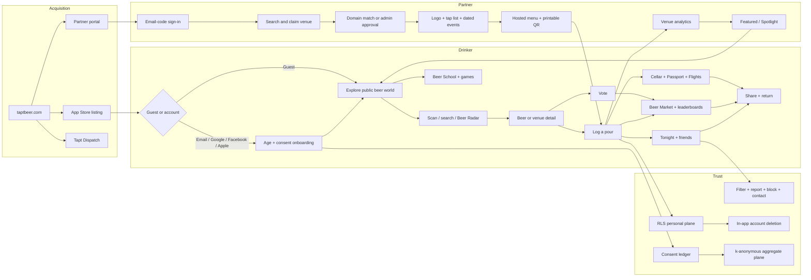
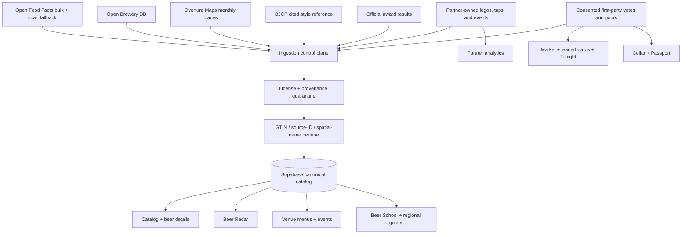
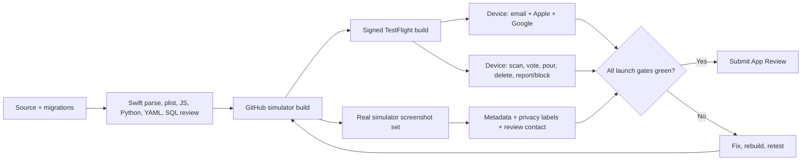

# Tapt End-to-End Journey and Ingestion Map

Ground truth as of 2026-07-12. This is the release control map for the landing
page, iOS app, partner portal, backend, and App Store path. A node is not
considered complete because a screen exists; its input, write, feedback,
downstream value, and failure recovery all have to close.

## Product system

## Content system

## Persona journeys

| Persona | First value | Required closed loop | Current release judgment |
|---|---|---|---|
| New / novice | Browse without committing, then identify one beer | Landing -> guest/email -> scan -> understandable beer page -> first pour -> Passport reward | Guest and email UI are built; signed-device auth and first-pour walkthrough remain gates |
| Casual local user | Find a credible place tonight | Location choice -> Beer Radar -> venue -> directions/menu/event -> pour | UI works, but live data is brewery-heavy and real events/taps are empty |
| Beer expert | Trust identity and depth | Search/scan -> canonical beer -> source-aware style/ABV/IBU/nutrition/awards -> private note | Catalog is broad; awards and premium partner media remain thin |
| Collector | See the product become personal | Repeated pours -> Cellar -> state/country/style Passport -> Flights/badges -> share | Built; must be tested with a real signed account and a non-empty collection |
| Social user | See a real friend signal | Follow -> visible pour -> report/block -> profile -> return | Built with honest empty states; no real activity exists yet |
| Venue owner | Publish something useful in one sitting | Portal OTP -> claim -> approval -> logo/menu/event -> QR -> analytics | Code path is complete; no real claim has exercised it end to end |
| Tapt operator | Safely approve and activate supply | Admin -> claim decision -> welcome -> campaign -> measurable reach | Admin/RPCs exist; live email and paid activation depend on owner services |

## Live data gap that drives the ingestion work

Verified against production on 2026-07-12:

| Surface | Live state | Decision |
|---|---:|---|
| Beer catalog | 11,054 | Keep OFF refresh and identity cleanup; volume is not the urgent gap |
| Breweries | 11,894 | Maintain provenance and current-status refresh |
| Venues | 8,694 | Expand beyond the brewery-only shape |
| Brewery venues | 8,651 | Strong cold-start layer |
| Bar venues | 43 | Materially incomplete |
| Pub / taproom / beer-garden venues | 0 / 0 / 0 | Materially incomplete |
| Upcoming events / tap items / claims | 0 / 0 / 0 | Workflows exist but have never been exercised by a real partner |
| Pours / votes | 0 / 0 | Never fabricate; launch density creates these |

The first mass-ingestion wave is therefore Overture Maps Places, not another
blind beer-product dump. `scripts/ingest_overture_venues.py` selects explicit
beer-serving categories, requires source confidence, balances by country and
region, preserves source/license metadata, and deduplicates against the OBDB
layer by source ID or nearby name match. The monthly workflow is
`.github/workflows/ingest-venues.yml`.

## Content waves

1. **Beer-place coverage:** Overture breweries, bars, pubs, beer bars, beer
   gardens, gastropubs, sports bars, and related beer-serving venues. Start
   with a dry run, audit country/category/license distribution, then ingest.
2. **Partner freshness:** real claims, menus, logos, and dated events. These
   must remain owner-published; no scraped tap lists or invented calendars.
3. **Beer authority:** official award facts with exact winner/source matching,
   deeper structured brewery facts, and partner-owned premium imagery.
4. **Regional relevance:** state/country guide coverage and local rails driven
   by canonical places plus real activity, never editorialized popularity.
5. **Retention content:** Dispatch issues, Beer School additions, Flights, and
   permissioned creator lists generated from cited catalog facts and real Tapt
   signals.

## Release gate

Hard blockers remain blockers until observed, not assumed:

- Supabase currently reports Apple provider disabled even though the app
  entitlement and native nonce flow exist.
- Google and email must succeed on the signed TestFlight build; simulator-only
  success is insufficient.
- App Store privacy answers, review contact, screenshots, and selected build
  must be complete and visually inspected.
- The newest source changes require a new signed build; build 45 predates them.
- The Overture migration and first ingestion must pass a dry run and count/
  provenance audit before production write volume is allowed.

## Acceptance tests

1. A guest can reach Home, Market, Beer Radar, Catalog, Beer School, and every
   game; any account-only action routes clearly to sign-in.
2. Email code, email link, Apple, and Google each create or restore a session
   on a physical TestFlight device and return to the intended screen.
3. A first pour appears in Cellar, stamps Passport correctly, and updates only
   consent-eligible aggregate/market inputs.
4. Every UGC surface exposes report/block; account deletion removes the auth
   identity and personal-plane rows.
5. A venue owner can claim, upload only to their own asset folder, publish taps
   and a dated event, open the public QR menu, and see honest zero analytics.
6. Beer Radar returns breweries plus non-brewery beer venues in all 50 states
   and the selected major-country regions after the audited ingestion.
7. All App Store screenshots are native captures at an accepted dimension,
   contain no loading/error state, and accurately represent the submitted build.
